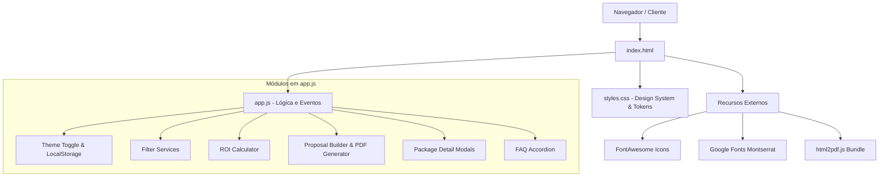
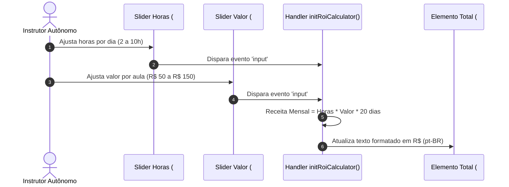
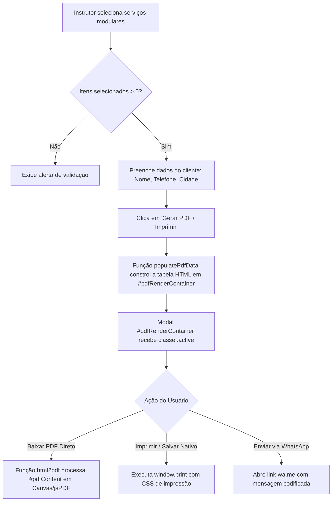

# 🏗️ Arquitetura do Sistema - Acelera Instrutor

Este documento descreve a arquitetura técnica, os padrões de design de código, os fluxos de dados e as convenções adotadas na aplicação web **Acelera Instrutor**.

---

## 🏛️ Visão Geral da Arquitetura

O sistema adota uma arquitetura **Single Page Application (SPA) Estática baseada em Vanilla JS**. A escolha por não utilizar frameworks pesados (como React, Angular ou Vue) garante os seguintes benefícios estratégicos:

1. **Desempenho Extremo**: Tempo de carregamento inferior a 1 segundo em conexões móveis (3G/4G).
2. **Custo de Hospedagem Zero**: Compatibilidade total com hospedagem estática (GitHub Pages, Netlify, Vercel).
3. **Facilidade de Manutenção**: Código JS modular sem necessidade de etapas complexas de compilação ou bundlers (`webpack`, `vite`).

---

## 📊 Diagramas de Arquitetura (Mermaid)

### 1. Estrutura da Aplicação & Componentes DOM



---

### 2. Fluxo da Calculadora de ROI e Estado em Tempo Real



---

### 3. Pipeline de Construtor de Orçamento e Exportação de PDF



---

## 🎨 Design System e Tokens CSS

Toda a identidade visual é controlada via **Custom Properties (Variáveis CSS)** no arquivo `styles.css`. Isso permite alterações de marca globais instantâneas.

### Principais Tokens Globais:
- `--navy-dark` (`#0B1E36`): Cor corporativa primária (Confiança e Autoridade).
- `--blue-brand` (`#0047AB`): Azul institucional para destaques e botões secundários.
- `--yellow-brand` (`#F4A900`): Amarelo ouro para badges, destaques e alertas.
- `--green-brand` (`#008744`): Verde esmeralda para botões de conversão e WhatsApp.
- `--font-main`: `'Montserrat', sans-serif`.

### Gerenciamento de Tema (Light / Dark Mode):
O tema é alternado dinamicamente pela alteração do atributo `data-theme` no elemento `<html>`:
```javascript
// Leitura do estado inicial no localStorage
const currentTheme = localStorage.getItem('prepara_theme') || 'light';
document.documentElement.setAttribute('data-theme', currentTheme);
```

As variáveis de fundo e texto são sobrescritas no bloco `[data-theme="dark"]` em `styles.css`:
```css
[data-theme="dark"] {
  --bg-primary: #06111E;
  --bg-surface: #0B1E36;
  --bg-card: #0E223D;
  --text-main: #F8FAFC;
  --text-muted: #94A3B8;
}
```

---

## 🔒 Segurança e Privacidade de Dados

- **Sem Coleta de Dados no Server-Side**: Como o aplicativo é estático e cliente-side, nenhum dado digitado no simulador ou no gerador de orçamentos é enviado para servidores externos.
- **Segurança de Links Externos**: Todos os links dinâmicos do WhatsApp utilizam `target="_blank"` e codificação de URL segura via `encodeURIComponent()`.
